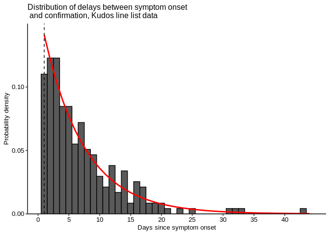
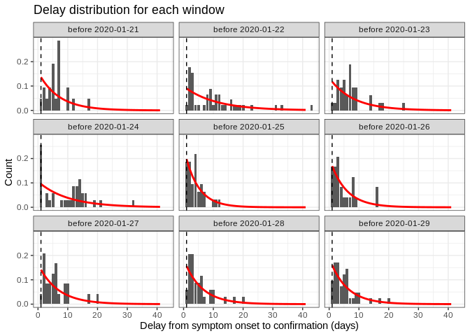
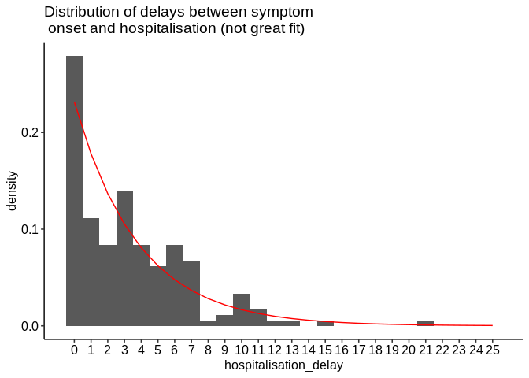
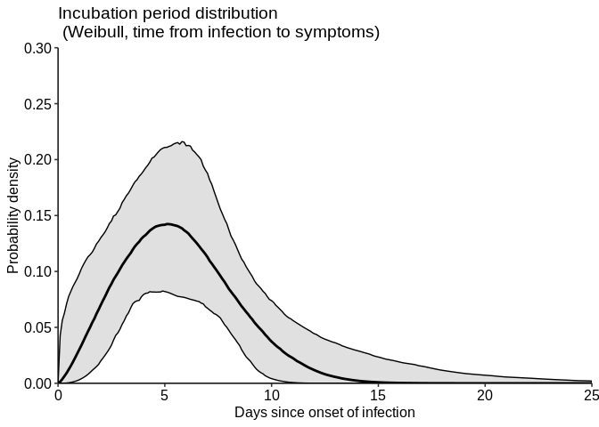
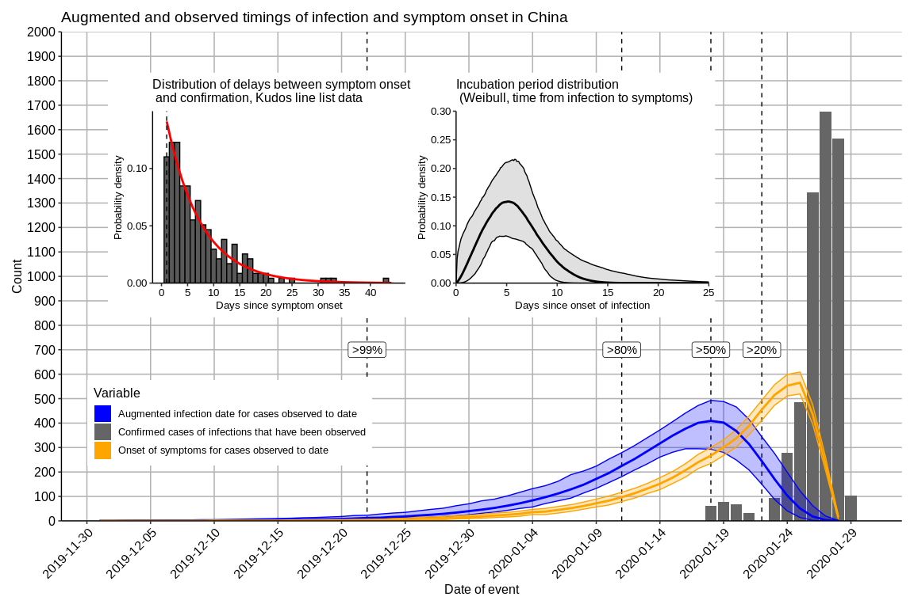
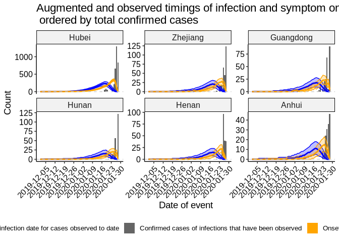
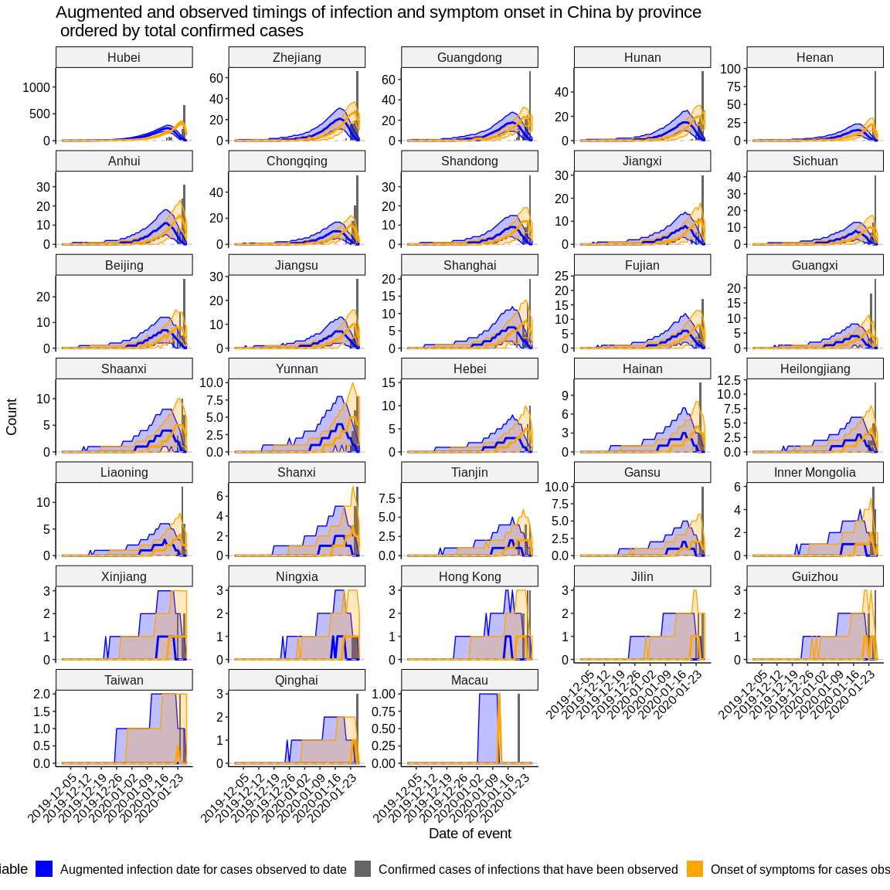

Turning nCoV case reports into infection incidence
================
James Hay <jhay@hsph.harvard.edu>

Updates
-------

6pm 29/01/2020:

1.  Confirmation delay distribution now uses the "Kudos" line list data available [here](https://docs.google.com/spreadsheets/d/1jS24DjSPVWa4iuxuD4OAXrE3QeI8c9BC1hSlqr-NMiU/edit#gid=1187587451)<sup>1</sup>
2.  Incubation period is now random draws from the posterior estimate from Backet et al. [here](https://www.medrxiv.org/content/10.1101/2020.01.27.20018986v1)<sup>2</sup>. In summary the mean is now around 5 days which is a big change.
3.  Linelist data is used for the confirmation delay distribution and for confirmed case counts at and before 21.01.2020. However, from 22.01.2020 onwards, we used the confirmed case reports as posted [here](https://gisanddata.maps.arcgis.com/apps/opsdashboard/index.html#/bda7594740fd40299423467b48e9ecf6)<sup>3</sup>.
4.  The data cleaning and pulling pipeline is now automated to automatically pull from the google sheets using the `googlesheets4` package. This should improve reproducibility and make updating easier.
5.  The main results panel now marks the times at which different percentages of infections that have happened are expected to have been observed.
6.  Started some further analyses on time between sub-epidemic onsets and change in confirmation delay distribution over time.
7.  Swapped the blue and orange colors - the focus should be on the infection incidence curve.

10am 27/01/2020:

1.  Added same plot facetted by province
2.  Ran sensitivity with mean incubation period of 5 days

Introduction
------------

Available line list data and confirmed case reports for 2019-nCoV mostly show the date of report and not the date of infection onset. These reported cases therefore do not directly represent underlying transmission dynamics, but rather the day at which sick individuals become known to the healthcare system plus some delay in reporting. To understand the dynamics of the outbreak, it is more informative to use the incidence curve for infections rather than case reports. Here, I try to generate realistic infection and symptom onset incidence curves that makes use of the confirmed case data from Hubei and elsewhere in China. I use a bootstrapping technique to propagate uncertainty through the predictions.

This does *not* provide any new data nor does it provide any sort of forward projections. This is simply to generate a range of plausible infection and symptom onset curves that could have given rise to the reported case data.

Results
-------

### Confirmation delay distribution

First, I calculated the distribution of times between symptom onset and date of confirmation *where known*. I assumed that cases had a reporting delay of *at least* one day (so the couple of dcases with a delay less than this were set to 1 day) Then, I fit a geometric distribution through these data.

``` r
p_confirm_delay_kudos
```

 The red line shows the geometric distribution fit. Dashed vertical line indicates first day post symptoms that confirmation could occur.

### Sliding window of confirmation times

Note that this is NOT used in the augmentation step yet. To assess how the delay between symptom onset and confirmation has changed over time, we ran the following algorithm:

1.  Start at the day of the first confirmed case. Go forward in time until at least 20 cases have been confirmed. use the confirmation delay distribution for all cases at or before this day as the first delay distribution.
2.  Go forward in time by a day. Count the number of case confirmations on this day . Set .
3.  Go back in time 1 day. Add the number of case confirmations for time .
4.  If the total number of confirmed cases in this window is , set  and go to step 2. Otherwise, go to step 3 and set  to .
5.  End

``` r
source("code/generate_delay_distributions.R")
p_sliding_delays
```



### Hospitalisation delay distribution

Not used for the augmentation step, but for prosperity here's the hospitalisation delay distribution from the line list data available at: <https://github.com/beoutbreakprepared/nCoV2019/blob/master/ncov_hubei.csv><sup>4</sup>:

``` r
p_other_hosp_fit
```

    ## Warning: Removed 5046 rows containing non-finite values (stat_bin).



### Incubation period distribution

Next, I generated a Weibull distribution with uncertainty for the incubation period. This was done by rerunning Weibull distribution fit by Backer et al<sup>1</sup> .

``` r
p_incubation
```



### Generating augmented infection and symptom onset times

First, we drew a random set of Weibull distribution parameters from the posterior distribution as described above. This forms the incubation period distribution for this sameple. Then for each case that is confirmed on a given day with no recorded symptom onset time, we generated a random symptom onset time by drawing a random value from the confirmation delay distribution and substracting it from the confirmation date. Then, for all confirmed cases, we generated a random infection times by drawing a random value from the incubation period and subtracting it from the symptom onset date.

### Bootstrapped incidence curves

To propagate the randomness from these distributions and thereby reflect uncertainty in onset times, we repeated this process 1000 times to generate 95% quantiles on the incidence curves. Note that the infection incidence curve drops towards the end. This is because a large number of infections that occured in the past have not yet been included in the case confirmation counts. The dashed vertical lines show the percentage of infections that have occured before *today's date* that we *expect* to have observed by now. See methods below.

``` r
results_panel_10day <- results_panel
results_panel_10day
```

    ## Warning: Removed 92 rows containing missing values (geom_path).



Spatial variation
-----------------

Same analysis, but with augmented times stratified by province. Note that this reveals that the augmented times use both confirmed cases and those with reported symptom onsets, which is why the orange/blue lines can overtake the grey.

``` r
by_province_top6
```

    ## Warning: Removed 6 rows containing missing values (geom_bar).

    ## Warning: Removed 92 rows containing missing values (geom_path).



``` r
by_province
```

    ## Warning: Removed 66 rows containing missing values (position_stack).

    ## Warning: Removed 33 rows containing missing values (geom_bar).

    ## Warning: Removed 94 rows containing missing values (geom_path).



Comments
--------

-   I have included 100 bootstrapped infection time and symptom onset time data sets in the git repo.
-   Modifying case data in this way might be useful as sensitivity analyses for models using the case reports as incidence (which is problematic if done naively)
-   We are hoping to extend these analyses quite a bit with sensitivity analyses and further visualisations.
-   Justin Lessler pointed out that the Weibull distribution tends to truncate the incubation period tails. A next step will be to use their log-Normal distribution estimates [here](https://github.com/HopkinsIDD/ncov_incubation#data-summary) as a comparison, but given the amount of uncertainty I don't expect this to make much difference<sup>5</sup>.
-   We are working on implementing nowcasting for the unobserved but (likely) existing cases.

Acknowledgements
----------------

Thanks to Amy Dighe, Charlie Whittaker, Michael Mina, Bill Hanage and Justin Lessler for discussions and suggestions (so far).

References
----------

1.  I think Kaiyuan Sun and colleages, "Kudos line list data" from <https://docs.google.com/spreadsheets/d/1jS24DjSPVWa4iuxuD4OAXrE3QeI8c9BC1hSlqr-NMiU/edit#gid=1187587451>
2.  Backer et al. The incubation period of 2019-nCoV infections among travellers from Wuhan, China. medRxiv doi: <https://doi.org/10.1101/2020.01.27.20018986>
3.  Wuhan Coronavirus (2019-nCoV) Global Cases (by Johns Hopkins CSSE) available at: <https://gisanddata.maps.arcgis.com/apps/opsdashboard/index.html#/bda7594740fd40299423467b48e9ecf6>
4.  <https://github.com/beoutbreakprepared/nCoV2019(https://github.com/beoutbreakprepared/nCoV2019>
5.  Real-time estimation of the Wuhan coronavirus incubation time, *JHU et al.*, <https://github.com/HopkinsIDD/ncov_incubation#data-summary>
6.  Höhle & an der Heiden Bayesan nowcasting during the STEC 0104:H4 outbreak in Germany, 2011;70(4):993-1002 <doi:https://doi.org/10.1111/biom.12194>
7.  Bastos et al. A modelling approach for correcting delays in disease surveillance data, 2019;38(22):4363-4377 <doi:https://doi.org/10.1002/sim.8303>

New method
----------

From the perspective of an individual, we can simulate random infection onset times from the date of their case confirmation. We can do this in two parts:

1.  Use the distribution of delays between symptom onset and case confirmation for known cases to generate a distribution of confirmation delays.
2.  Assume some form of the incubation period to generate a distribution of times between infection and symptom onset.

For each confirmation date, we can simulate both parts of the delay to get a predicted infection onset time. We can then do this many times to get a distribution of infection onset times for each individual that takes into account uncertainty in the confirmation delay and incubation period distributions.

Data and parameters
-------------------

I use two case report data sets and one incubation period data set.

1.  Line list data compiled here: <https://docs.google.com/spreadsheets/d/1jS24DjSPVWa4iuxuD4OAXrE3QeI8c9BC1hSlqr-NMiU/edit#gid=1187587451><sup>1</sup>. This is used to infer the confirmation delay distribution and total confirmed cases on and before 21.01.2020.
2.  Cumulative case counts stratified by province from here: <https://gisanddata.maps.arcgis.com/apps/opsdashboard/index.html#/bda7594740fd40299423467b48e9ecf6><sup>3</sup>. These data went through a few cleaning steps: i) used only numbers from the *last* report for each day to get daily numbers; ii) find the change in number of cumulative reported confirmed cases for each day. Set this to 0 when case numbers went down.
3.  Re-ran the model fitting procedure by Backer et al. in their medarxiv paper here: <https://www.medrxiv.org/content/10.1101/2020.01.27.20018986v1><sup>2</sup>. I then took random draws from posterior distribution of parameters for the fitted Weibull distribution. This allows uncertainty in the incubation period to be pushed through the model.

Proportion of cases that should have been observed by now
---------------------------------------------------------

To be updated properly in the next few days, but essentially for each day, we ask the question "what proportion of infections that have happened to we expect to have observed by now". The code for this is in the script `code/unobserved_proportion.R`. Thanks to Charlie Whittaker from Imperial College London who suggested this idea from his experience working with colleage on the Ebola outbreak<sup>6,7</sup>.

``` r
plot(times, rev(cumsum(prop_seen)), type = "l", 
     xlab = "Date",
     ylab = "Proportion of Infections Occurring That Day \nThat Have Been Reported By the Current Day")
```


Old method and logic
--------------------

The expected time of actual infection is given by:


The number of cases reported on a given day is therefore the sum of infections that occured on all preceding days multiplied by the probability that those cases entered the hospital (and were therefore reported) on that day of their infection.

Another way of thinking about it is that the number of infections on a given day  is the sum of all cases that happened on all future days , multipled by the probability of a case that started on day  entering healthcare  days after infection.

 = \sum_{i=t}^{t+t_{max}} C(i)*p(i-t)")

where ") is the number of infections on day ; ") is the number of cases reported on day ; and ") is the probability of entering the hospital  days since the start of infection
